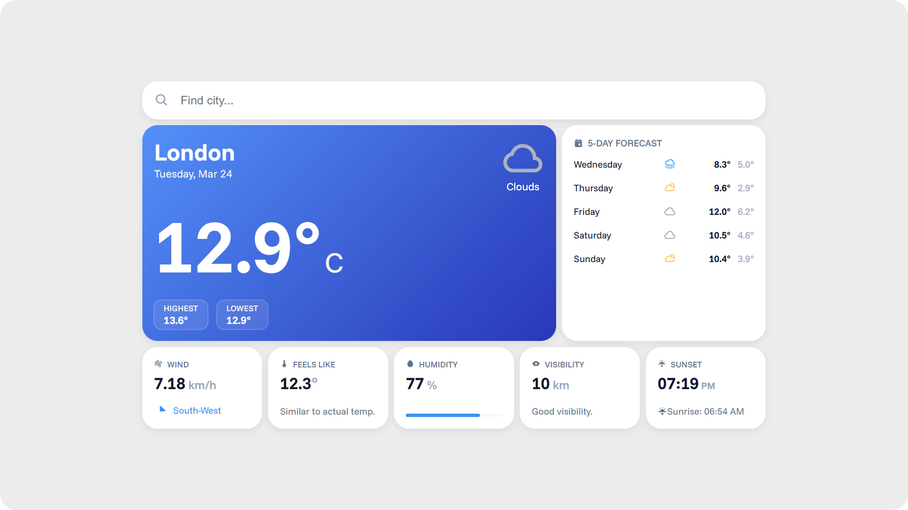

# 🌤️ Weather Dashboard



An elegant, fully responsive weather dashboard. This application provides real-time meteorological data, a 5-day forecast, and detailed weather conditions for any city around the globe.

## ✨ Features

* **Real-Time Weather:** Accurate current temperature, daily highs/lows, and clear condition descriptions.
* **5-Day Forecast:** A clean overview featuring pixel-perfect icon alignment powered by CSS Grid.
* **In-Depth Metrics:** Displays wind speed and dynamic direction, feels-like temperature, humidity (with a visual progress bar), and visibility assessments.
* **Sun Tracking:** Precise sunrise and sunset times separated into distinct typography for better readability.
* **Fluid Responsiveness:** Built with a Mobile-First and Desktop-First approach utilizing the CSS `clamp()` function and modern layout grids for a seamless experience on any device screen.

## 🛠️ Tech Stack

* **HTML5:** Semantic structure and accessibility.
* **CSS3:** Custom Properties (Variables), CSS Grid, Flexbox, Fluid Typography (`clamp`), and Custom Autofill Styling.
* **JavaScript (ES6+):** Asynchronous data fetching (`async/await`), DOM manipulation, and ES6 Modules.
* **APIs:** [OpenWeatherMap API](https://openweathermap.org/) (Geocoding API & 5-Day Forecast API).
* **Assets:** [Boxicons](https://boxicons.com/) for scalable vector icons and [Google Fonts (Funnel Sans)](https://fonts.google.com/) for clean typography.

## 🚀 Local Installation & Setup

This project uses ES6 Modules (`import`/`export` syntax), which means it must be run via a local web server (e.g., Live Server extension in VS Code) rather than simply opening the HTML file directly in a browser.

1.  **Clone the repository:**
    ```bash
    git clone https://github.com/seddySedlak/Weather-dashboard.git
    cd Weather-dashboard
    ```

2.  **Get an API Key:**
    * Create a free account at [OpenWeatherMap](https://openweathermap.org/).
    * Generate your unique API key.

3.  **Configure the environment:**
    * In the root folder of the project, create a new file named `config.js`.
    * Insert your API key using the following format:
        ```javascript
        export const API_KEY = "your_generated_api_key_here";
        ```

4.  **Run the application:**
    * Launch the project using Live Server or any other local development server.

> **⚠️ Important Security Note:**
> Ensure you have a `.gitignore` file in your repository root and that it includes `config.js`. API keys must never be committed and pushed to public GitHub repositories!
